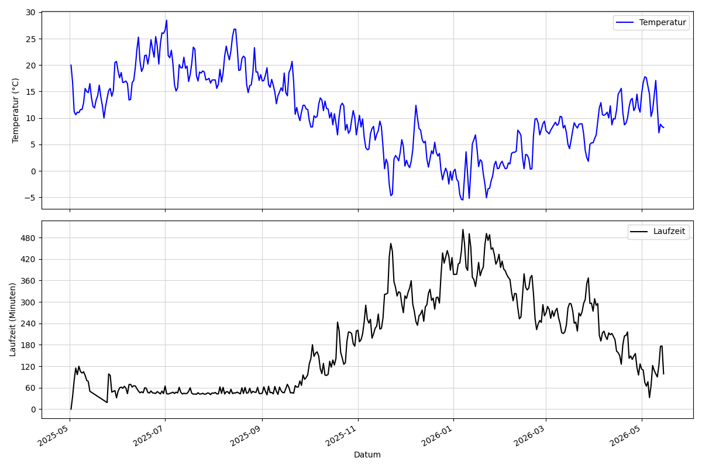

# heating_tracking

This project is intended to track the oil consumption of my local oil heater.
Within an oil burner, the oil consumption is proportional to the duration the magnet valve is being opened.
For that reason, a simple ESP32866 arduino was created to track the on/off events of the relvant magnet valve that regulates the oil flow of the oil burner.
The corresponiding time values were then sent via MQTT to a raspberry PI that was acting a MQTT broker and further also collecting the time values.

## Results

